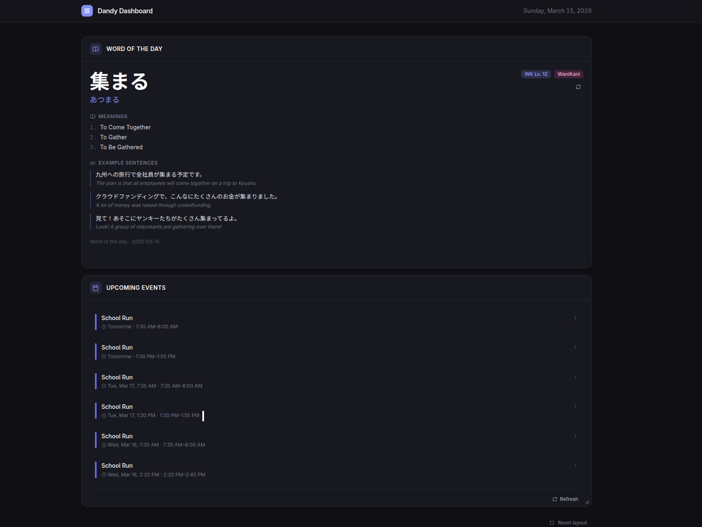

# Dandy Dashboard

A personal, modular dashboard built with a Go backend and Svelte frontend. Drop in the widgets you want — adding a new one is a few files each side.

Right now, this is entirely codified as opposed to pluggable within the browser.

This was made in conjunction with an AI Agent and purely being done as a way to refresh and relearn newer frameworks in conjunction with understanding the current agent model capabilities.



## Widgets

| Widget | Description |
|---|---|
| **Word of the Day** | Daily Japanese vocabulary pulled from your WaniKani Apprentice/Guru items, with readings, meanings, and example sentences |
| **Upcoming Events** | Next events from Google Calendar via a service account |
| **Claude AI** | Streaming chat with Claude Opus 4.6, with server-side conversation history and adaptive thinking |

## Tech Stack

- **Backend** — Go 1.25, stdlib `net/http` (no framework)
- **Frontend** — [Svelte 5](https://svelte.dev/) + TypeScript + Vite + Tailwind CSS
- **AI** — [Anthropic API](https://docs.anthropic.com/) (Claude Opus 4.6, streaming SSE)
- **Calendar** — Google Calendar API (service account)
- **Persistence** — [bbolt](https://github.com/etcd-io/bbolt) embedded KV (default) or Redis

## Getting Started

### 1. Clone & configure

```bash
git clone https://github.com/dandydeveloper/dandy-dashboard
cd dandy-dashboard
cp .env.example .env
# Edit .env — ANTHROPIC_API_KEY is required at minimum
```

### 2. Run in development

**Terminal 1 — backend** (with hot reload via [air](https://github.com/air-verse/air)):
```bash
make dev-backend
```

**Terminal 2 — frontend** (Vite HMR):
```bash
make dev-frontend
```

Open [http://localhost:5173](http://localhost:5173).

### 3. Production with Docker

```bash
docker compose up --build
```

Frontend is served by Nginx on port 80. The backend API is internal — Nginx proxies `/api/*` to it.

## Configuration

All configuration is via environment variables (`.env` file locally, secrets manager in production).

| Variable | Required | Default | Description |
|---|---|---|---|
| `ANTHROPIC_API_KEY` | Yes | — | From [console.anthropic.com](https://console.anthropic.com/keys) |
| `WANIKANI_API_TOKEN` | No | — | From [wanikani.com/settings/personal_access_tokens](https://www.wanikani.com/settings/personal_access_tokens) — enables WaniKani word source |
| `GOOGLE_CREDENTIALS_JSON` | No | — | Path to service account JSON file, or raw JSON string |
| `GOOGLE_CALENDAR_ID` | No | `primary` | Calendar ID from Google Calendar settings |
| `PORT` | No | `8080` | Backend listen port |
| `ALLOWED_ORIGINS` | No | `http://localhost:5173` | Comma-separated CORS origins |
| `DASHBOARD_KEY` | No | — | Shared secret for `X-Dashboard-Key` header — **set this in production** |
| `DATA_DIR` | No | `./data` | Directory for the embedded bbolt database |
| `STORE_URL` | No | — | Redis URL (e.g. `redis://localhost:6379`) — overrides bbolt |

### Google Calendar setup

1. Create a project in [Google Cloud Console](https://console.cloud.google.com)
2. Enable the **Google Calendar API**
3. Create a **Service Account** — no IAM role needed
4. Download the JSON key → set as `GOOGLE_CREDENTIALS_JSON`
5. In Google Calendar, share your calendar with the service account email → **"See all event details"**

## Adding a Widget

The plugin system is explicit — no magic. A few files each side.

**Backend** — create `internal/widgets/mywidget/`:
```go
// widget.go — implement the Widget interface
func (w *Widget) Slug() string { return "mywidget" }

func (w *Widget) RegisterRoutes(mux *http.ServeMux) {
    mux.HandleFunc("GET /data", w.handler.Data)
}
```
Then register in `cmd/server/main.go`:
```go
registry.Register(mywidget.New(cfg))
```

**Frontend** — create `web/src/widgets/mywidget/`:
```typescript
// index.ts
export const myWidget: WidgetDescriptor = {
  id: 'mywidget',
  title: 'My Widget',
  description: '...',
  component: MyWidgetComponent,
  defaultSize: 'md',
}
```
Then add one line to `web/src/widgets/registry.ts`:
```typescript
export const widgetRegistry = [japaneseWidget, calendarWidget, myWidget]
```

The widget appears in the resizable grid automatically.

## Project Structure

```
dandy-dashboard/
├── cmd/server/main.go              # Entry point — wires config, registry, server
├── internal/
│   ├── config/                     # Env-based configuration
│   ├── httputil/                   # JSON response helpers
│   ├── middleware/                 # Logger, recover, request ID, CORS, API key
│   ├── store/                      # bbolt / Redis abstraction
│   ├── widget/                     # Widget interface + registry
│   └── widgets/
│       ├── claude/                 # Claude AI chat (streaming SSE, session management)
│       ├── japanese/               # Word of the day (WaniKani + Jotoba)
│       └── calendar/               # Google Calendar events
├── docker/
│   ├── backend.Dockerfile
│   ├── frontend.Dockerfile
│   └── nginx.conf                  # Serves static files, proxies /api/* to backend
└── web/src/
    ├── widgets/
    │   ├── types.ts                # WidgetDescriptor interface
    │   ├── registry.ts             # All active widgets registered here
    │   ├── claude/
    │   ├── japanese/
    │   └── calendar/
    ├── components/
    │   ├── DashboardGrid.svelte    # Resizable 12-column grid (layout persisted to localStorage)
    │   └── WidgetCard.svelte       # Shared card shell
    └── stores/
        └── layout.ts               # Grid layout state + localStorage persistence
```

## Security

- API endpoints are optionally protected by a shared `X-Dashboard-Key` header (`DASHBOARD_KEY` env var) — **enable this if the dashboard is publicly reachable**
- CORS is restricted to `ALLOWED_ORIGINS`
- Request bodies are capped at 512 KB; messages at 32 KB
- Chat sessions expire after 24 hours of inactivity
- Containers run as non-root
- Raw errors from external APIs are never forwarded to the client

## License

MIT
